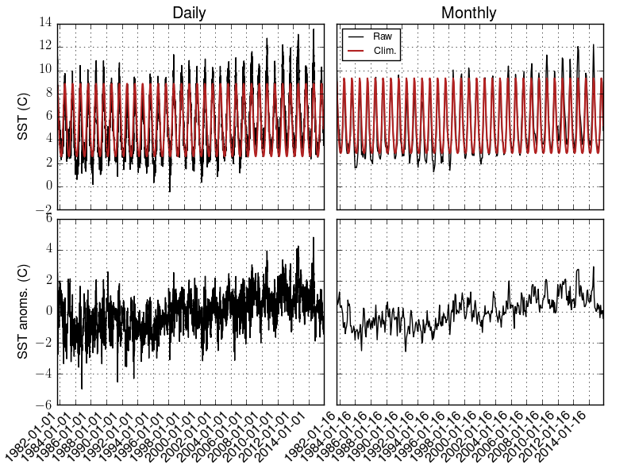

.. _climato_daily:

Climatologies
*****************************

Daily time scales
-------------------------------------

Daily climatologies are computed by using the
:func:`envtoolkit.ts.compute_daily_clim` function:

.. code-block:: python

   import envtoolkit.ts
   clim = envtoolkit.ts.compute_daily_clim(data, date, smooth=True, nharm=2)

The `data` variable is the variable from which the climatology is
extracted. It can be of any dimension, but the climatology is computed
on the first dimension (which should be time). The `date` variable is
the date associated with the data, with a format YYYYMMDD (YYYY=year,
MM=month, DD=day). It must have the same length as the first dimension
of `data`.

The `smooth` arguments defines whether the seasonal cycle should be
smoothed out. If set to `True`, a filtering is applied through fft
computation. The `nharm` argument is the number of harmonics to retain
in the fft calculation. For instance, a value of 2 means to use the annual and semi-annual harmonics only.

Anomalies are computed by using the function :func:`envtoolkit.ts.compute_daily_anom`

.. code-block:: python

   anom = envtoolkit.ts.compute_daily_anom(data, date, clim)

The two first arguments are the same as for the
:func:`envtoolkit.ts.compute_daily_clim` function, while the last one is the
climatology that was computed on the previous step.

.. _climato_monthly:

Monthly time scales
-----------------------------------

The computations of monthly seasonal cycles and monthly anomalies
relative to these seasonal cycles are very similar to the computations
for daily time scales. 

.. code-block:: python

   import envtoolkit.ts 
   clim = envtoolkit.ts.compute_monthly_clim(data, date)
   anom = envtoolkit.ts.compute_monthly_anom(data, date, clim)

In the :func:`envtoolkit.ts.compute_monthly_clim` function, `data` is the
data array, the seasonal cycle of which to extract (with time as the
first dimension). `date` is a date vector, with a format YYYYMM (YYYY=year,
MM=month). Note that contrary to the daily counterpart, there
is no smoothing possible here.

Example
---------------------------------

.. literalinclude:: _static/figure_climato.py

.. figure:: _static/figure_climato_2.png
   :width: 60%
