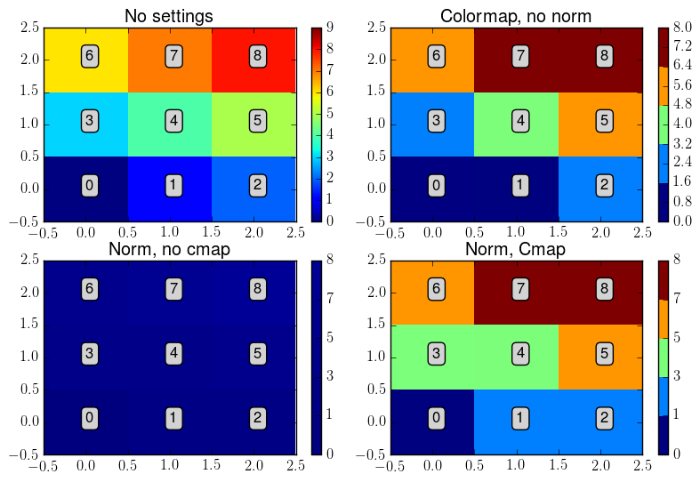

.. _cmapnorm:

Normalisation of colors
***************************

Introduction
---------------------------

Sometimes, you may want to do a figure in which patterns, identified for instance by using a clustering technique (k-means, etc), are represented by a specific color. To do this properly requires to manage both the colormap: both its number of colors but also the normalisation. The latter is the way a data is mapped to a specific color. To this purpose, two specific functions have been created. 

Let's see how it works on a specific example. Imagine we have a 3 by 3 matrix, with values ranging from 0 to 8. We want to display the values which are between 0 and 1, 1 and 3, 3 and 5, 5 and 7, and 7 and 8 (therefore, 5 colors).

Creation of the colormap
--------------------------------------------

As a first step, one needs to create a colormap containing 5 colors. A first possibility is to use the :py:class:`envtoolkit.colors.Initcmap` class, and to call the :py:func:`envtoolkit.colors.Initcmap.makecmap` with *nbcol=5*. If the user wants to use a default `Matplotlib colormap <http://matplotlib.org/examples/color/colormaps_reference.html>`_, the user must convert it into a 5 colors colormap. This is done by using the :py:func:`envtoolkit.colors.subspan_default_cmap` function as follows:

.. code-block:: python
    
    ncolors = 5
    cmap_jet_ncolors = envtoolkit.colors.subspan_default_cmap("jet", ncolors)
    
The first argument is the name of the Matplotlib colormap, the second argument is the number of colors to use in the colormap

Creation of the normalisation instance
--------------------------------------------

The next step is to create the :py:class:`matplotlib.colors.Normalize` instance, that will handle the mapping of the data with the colors. This is achieved with the :py:func:`envtoolkit.colors.make_boundary_norm` function:

.. code-block:: python

    boundaries = [0, 1, 3, 5, 7, 8]
    norm = envtoolkit.colors.make_boundary_norm(ncolors, boundaries)

The first argument is the number of colors that will be displayed by the colormap, and the second argument is an array containing the values of the colormap "edges".  

.. warning:: 
    
    The number of elements in the second arguments must me equal to ncolors+1. If it is not, the program will raise an error.

Plotting
--------------------------------------------

Now that we have defined our normalisation and our colormap, we can draw the figure:

.. code-block:: python

    plt.figure()
    pcolormesh(array, norm=norm, cmap=cmap_jet_ncolors)
    plt.show()

Example
-------------------------------------

In the following code, we compare the representation of the example array when:
    - No changes in norm and cmap are applied (upper left)
    - No changes in norm are applied (upper right)
    - No changes in cmap are applied (lower left)
    - Changes in both norm and cmap are applied (lower right)

You will see that the only way to do it properly is to change both the norm and the cmap.

.. literalinclude:: _static/figure_col_norm.py

