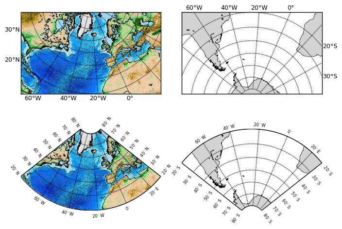

.. _lambert:

Lambert projection
************************

.. _lamber-intro:

Introduction
---------------------------------

This module is aimed at using the Lambert Conformal Conic (LCC) projection in the same way as in Matlab or NCL. To use this projection in Basemap, you must provide the coordinates of the lower-left and upper right corners, which you don't necessaryly know. In Matlab and NCL, this projection is initialised by providing the western and eastern longitudes, and the southern and northern latitudes. The lambert module allows to mimic this behaviour. Furthermore, it is not possible to use a masked projection in Basemap. This drawback is sorted out here.

.. _lamber-init:

Initialisation
---------------------------------

As a first step, you need to initialise the :py:class:`envtoolkit.map.Lambert` class, which is done by providing the domain coordinates:

.. code-block:: python

    from envtoolkit.map import Lambert

    lon1=-80;lon2=30;lat1=20;lat2=80
    lamb=Lambert(lon1,lon2,lat1,lat2)

During the initialisation, the `lamb.lonmin`, `lamb.lonmax`, `lamb.latmin`, `lamb.latmax` are set, which contains the western and eastern longitudes, and the southern and northern latitudes (used as arguments). The `lamb.hemisphere` attribute, which defines whether we are in the southern or northern hemisphere, is also created. 

.. note:: The domain used in a LCC projection cannot cross the equator. Therefore, the `lamb.latmin` and `lamb.latmax` attributes must have the same sign.

During this initialisation phase, a :py:class:`mpl_toolkits.basemap.Basemap` object, `lamb.bmap`, is also created, which you now can use to draw your map backgrounds (map grid, coastlines, filled continents, map backgrounds, etc).   

.. _lamber-masking:

Masking
---------------------------------

A classical way to display LCC maps is to mask the map outside the domain boundaries. In this module, this is achieved by overlaying a dummy pcolor plot on top the map (transparent colors inside the domain, background colors outside). This is achieved by a call to the :py:func:`envtoolkit.map.Lambert.make_mask` function as follows:

.. code-block:: python

    lamb.make_mask()

.. warning:: Doesn't work properly when saving PDF files 

.. _lamber-labels:

Map labels on masked LCC
---------------------------------
Because of the way masking is achieved, map labels cannot be achieved by using the native `Basemap` functions. This is done by using the :py:func:`envtoolkit.map.Lambert.add_lc_labels` function (adapted from NCL) as follows:

.. code-block:: python

    lamb.add_lc_labels()

.. _lamber-example:

Example
---------------------------------

.. literalinclude:: _static/figure_lambert.py

