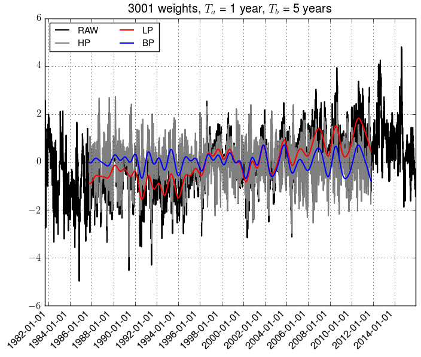

.. _lanczos:

Lanczos filtering
*****************************

Introduction
---------------------------------
The :py:class:`envtoolkit.ts.Lanczos` class allows to perform temporal filtering of data.

Creation of the filter
---------------------------------
As a first step, the user must create a filter. This is done by initialising the :py:class:`envtoolkit.ts.Lanczos` as follows:

.. code-block:: python
    
    import envtoolkit.ts

    nwts = 61
    ta = 365
    dt = 1
    filthp = envtoolkit.ts.Lanczos("bp", nwts, ta)

The initialisation takes as argument the type of filter (`hp` for high-pass filter, `lp` for low-pass filter and `bp` for high pass filter), the number of weights (must be an odd number), the cut-off period `ta`. Additional arguments are the second cut-off periods for band-pass filter `tb` (default is `None`) and the time-step `dt` (default is 1, must have the same units as `ta` and `tb`). 

Filtering a time-series
---------------------------------
The filtering of a time series is achieved by using the :py:func:`envtoolkit.ts.Lanczos.wgt_runave` function, which is largely inspired from `NCL's function <https://www.ncl.ucar.edu/Document/Functions/Built-in/wgt_runave.shtml>`_. This function is called as follows:

.. code-block:: python

    ts_filt = filthp.wgt_runave(ts)

with `ts` a data of any dimension. 

Example
---------------------------------

.. literalinclude:: _static/figure_lanczos.py

