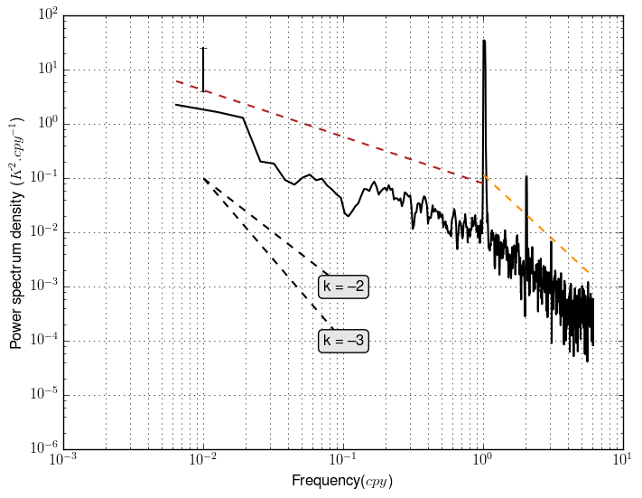

.. _mtaper:

Multitaper 
*****************************

Introduction
---------------------------------

The multitaper functions presented here are adapted from the `ptmtPH.m <http://www.people.fas.harvard.edu/~phuybers/Mfiles/>`_ script by Peter Huybers (for the calculation of the power spectrum) and from the `JD_spectra.m <http://www.icemasa.org/education/masters-classes/Statistical%20methods%20applied%20to%20climatology/deshayes_CNRS_IRD_2013_csm_ps.zip/view>`_ (see also the `deshayes_CNRS_IRD_2013_csm5.pdf <http://www.icemasa.org/education/masters-classes/Statistical%20methods%20applied%20to%20climatology/deshayes_CNRS_IRD_2013_csm_lectures.zip/view>`_ file for a description of the method).

Plotting the spectrum
---------------------------------

The plotting of the spectrum is achieved by using the :py:func:`envtoolkit.spectral.plot_spectra` function. It takes as argument the time series from which to plot the spectra, the time-sampling period (in seconds) and the period at which to plot the error bar. Additional arguments are the spectrum type (variance or energy spectrum) and the number of tapers. Arguments associated with the :py:func:`matplotlib.pyplot.plot` function can be also used. The outputs are the power spectrum, the associated frequency and the error bar.

.. code-block:: python

    spec, freq, error = envtoolkit.spectral.plot_spectra(sst, deltat, 
                                                      ferror, spec_type='variance', 
                                                      nbandw=3, color='k')

Determining the slope
---------------------------------

It might be interesting to dermine the slope of a power spectrum. This is achieved by using the :py:func:`envtoolkit.spectral.plot_slope` function. It takes as an argument the spectrum and frequency outputs of the :py:func:`envtoolkit.spectral.plot_spectra` function. It may also takes as argument the first and/or last frequency on which to compute the slope (if not set, the slope is computed over the entire frequency range). It may also take as argument the vertical offset of the slope lines (in order to improve readability of the figure) and arguments which are associated with the :py:func:`matplotlib.pyplot.plot` function. It returns the value of the slope.

.. code-block:: python

    slope = envtoolkit.spectral.plot_slope(spec, freq, fmin=1e-2, 
                                        fmax=1, offy=2, 
                                        color='FireBrick', linestyle='--')

Overlying reference slopes
---------------------------------

In a figure, the user may want to plot one or several reference slopes, in order to highlight the value of the slope associated with the the power spectrum. Thisis achieved by using the :py:func:`envtoolkit.spectral.plot_slope` function. It takes as argument the lower and upper frequency value on which to plot the slope, the slope intercept and the value of the slope. It also handles additional arguments associated with the :py:func:`matplotlib.pyplot.plot` function.

.. code-block:: python

    envtoolkit.spectral.plot_ref_slope(fmin_slope, fmax_slope, 
                                    yinter_slope, slope=-3, 
                                    color='k', linestyle='--')

Example
------------------------

.. literalinclude:: _static/figure_mtaper.py

