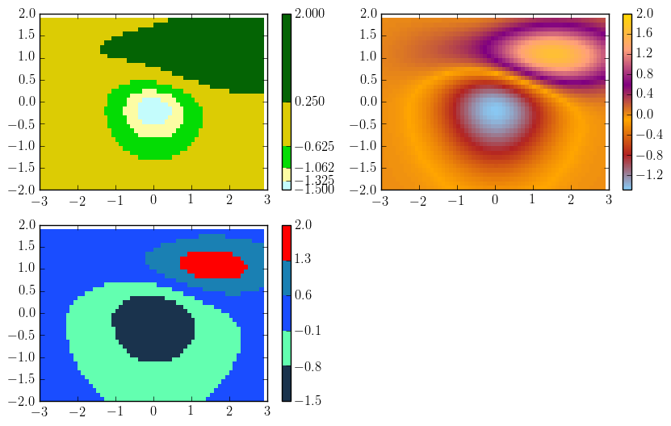
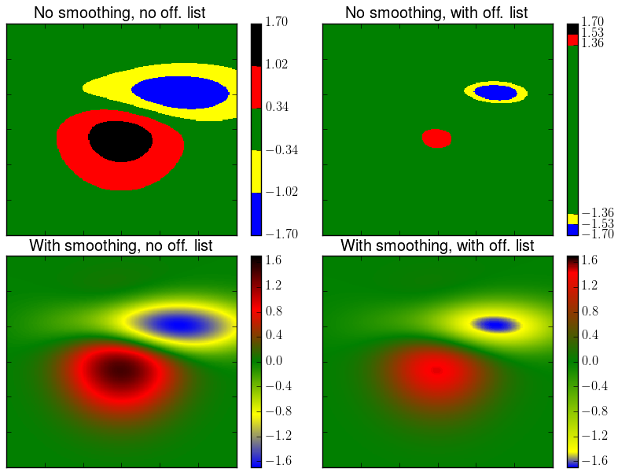

.. _newcmap:

Fancy colormaps
***************************

.. _newcmap-intro:

Introduction
---------------------------

The :py:class:`envtoolkit.colors.FancyCmap` class is devoted to the use and creation of new
colormaps. They can either be read from .svg files, downloaded from
the cpt-city website (http://soliton.vm.bytemark.co.uk/pub/cpt-city/),
or created by using a list of named colors or an array of colors (in percentage)

.. _newcmap-init :

Initialisation of the FancyCmap class
--------------------------------------------

As a first step, one needs to initialize a :class:`envtoolkit.colors.FancyCmap` class. This
class is initialised either by a string (the name of the .svg file
that contains the colormap), a list or a numpy array.

Initialisation using a string
^^^^^^^^^^^^^^^^^^^^^^^^^^^^^^^^^^^

The .svg files must be stored in a directory, which is accessed
through the $SVG environment variable. If one wants to use, for
instance, the colormap defined in the `arctic.svg` file,
the :class:`envtoolkit.colors.FancyCmap` class is initialised as follows:

.. code-block:: python
    
    import envtoolkit.colors
    obj = envtoolkit.colors.FancyCmap('arctic', reverse=False)

The `reverse`
boolean indicates whether the colormap should be reversed or not
(equivalent to putting a `_r` on the matplotlib colormap).

Initialisation using a list
^^^^^^^^^^^^^^^^^^^^^^^^^^^^^^^^^^^

A :class:`envtoolkit.colors.FancyCmap` class can also be created by using a list of named
colors. This is achieved as follows:

.. code-block:: python
    
    import envtoolkit.colors
    colors = ['gold', 'lightsalmon', 'purple',
             'orange', 'firebrick', 'lightskyblue']
    obj = envtoolkit.colors.FancyCmap(colors, smooth=False, reverse=False)

If the `smooth` argument is set to `False` (which is the default
setting), the colormap will be discrete. If it is set to `False`, the
colormap will be of gradient type.
    
Initialisation using an array
^^^^^^^^^^^^^^^^^^^^^^^^^^^^^^^^^^^

A :class:`envtoolkit.colors.FancyCmap` object can also be created by using a numpy.array that
contains `rgb` values (either in percentage or as 8 bits integer):

.. code-block:: python
    
    import envtoolkit.colors
    colors = np.array([
                 [10, 20, 30],
                 [39, 100, 69],
                 [100, 100, 100],
                 [10, 50, 70],
                 [100, 0, 0]
		 ])/100.
		 
    obj = envtoolkit.colors.FancyCmap(colors, smooth=False)

User defined offset list
^^^^^^^^^^^^^^^^^^^^^^^^^^^^^^^^^^^

In the default mode, the offset (i.e. the location of the color edges on the colorbar) is automatically defined for a colormap initialised from a list or a RGB array. For instance, in a colorbar inialised with 5 colors ('R', 'G', 'B', 'C', 'M'), we have the following cases, depending on the value of the `smooth` argument:

If `smooth` is False: 

.. code-block:: none

    RRRRRRRRRRRRRRGGGGGGGGGGGGGGGBBBBBBBBBBBBBBCCCCCCCCCCCCCCMMMMMMMMMMMMMM
    |-------------|-------------|-------------|-------------|-------------|
    0            0.2           0.4           0.6           0.8            1  

If `smooth` is True:

.. code-block:: none

    R      interp       G     interp    B     interp      C    interp   M
    |-------------------|---------------|-----------------|-------------|
    0                  0.25            0.5               0.75           1  

with the `interp` meaning that the colors are linearly interpolated in between.

In the initialisation of the `Fancycmap` object, the user also has the possibility to use his own offset array (`list_offset` argument), which must contains as many values as colors:

.. code-block:: python
    
    offset = [0, 0.05, 0.1,  0.9, 0.95, 1]
    svg = FancyCmap(input_cmap, list_offset=offset)

Again, the result will depend on the `smooth` option.

If `smooth` is False: 

.. code-block:: none

    RRRRRRRGGGGGGGBBBBBBBBBBBBBBBBBBBBBBBBBBBBBBBBBBBBBBBCCCCCCCMMMMMMM
    |------|------|--------------------------------------|-----|-------|
    0   0.05     0.1                                    0.9   0.95     1

If `smooth` is True:

.. code-block:: none
    
    R   int   G         int          B         int           C   int   M
    |---------|----------------------|-----------------------|---------|
    0       0.075                   0.5                    0.925       1

Therefore, the real blue color in the smoothed colormap would be located at the middle of the blue color of the unsmoothed colormap. This is true for all the colors but the frst and the last one.

An example is provided in the :ref:`newcmap-example` section.

.. _newcmap-cmap :

Creation of the colormap
-------------------------------------
     
Now that the :class:`envtoolkit.colors.FancyCmap` has been initialised, a colormap that
can be used by :mod:`matplotlib` must be created. This is achieved by the
:func:`envtoolkit.colors.FancyCmap.makecmap` function

.. code-block:: python

    cmap = obj.makecmap(N=256)
    
This function takes to optional arguments. The `N`
integer provides the number of rgb quantization levels. 

.. _newcmap-ticks :

Definition of nice ticks
-------------------------------------

In the case of discrete and irregular colormaps (for instance, the
`njavgcntyq.svg` one), it might be nice to have the ticks of the
colormaps that match the color separations. This is achieved by the
:func:`envtoolkit.colors.FancyCmap.write_cbticks`, which takes as arguments the :py:class:`matplotlib.colorbar.Colorbar` object.

.. code-block:: python

  import envtoolkit.colors
  obj = envtoolkit.colors.FancyCmap('njavgcntyq') 
  cmap = obj.makecmap()
  cs = plt.pcolor(x, y, Z, cmap=cmap)

  plt.clim(lmin, lmax)
  cb = plt.colorbar(cs)
  obj.write_cbticks(cb)

.. _newcmap-example :

Examples
-------------------------------------

.. literalinclude:: _static/figure_fancycmap.py

.. literalinclude:: _static/figure_fancycmap_offsets.py

